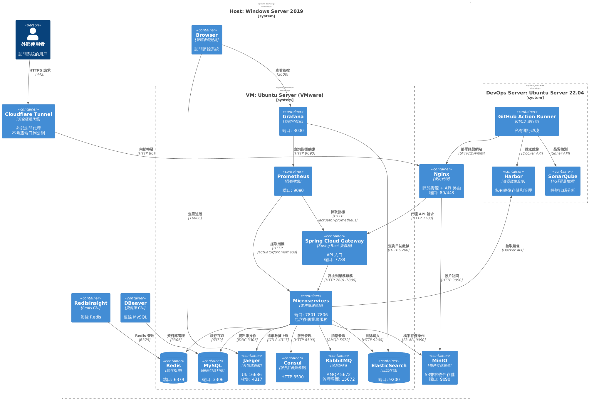

# Infra

本專案採用 **C4 Container Model** 描述整體基礎設施與服務依賴。架構分為 Host 與 VM 兩層，並搭配多種中介軟體、監控與管理工具，確保系統高可用性與可觀測性。



## Host: Windows Server 2019

在宿主機層級，部署主要的反向代理與存儲服務，並提供管理工具：

- **Nginx**：負責靜態資源的存取與 API 反向代理，對外提供 `80/443` 端口。
- **MinIO**：作為物件存儲服務，S3 API 相容，提供檔案存取功能。
- **管理工具**：
  - **DBeaver**：資料庫管理工具，連線 MySQL。
  - **RedisInsight**：管理與監控 Redis。
  - **Browser**：管理者透過瀏覽器存取 Grafana 與 Jaeger 等可視化服務。

## VM: Ubuntu Server (VMware)

虛擬機器內承載主要的業務微服務與基礎設施：

- **Spring Cloud Gateway**：API 入口，提供微服務統一入口點與路由。
- **中介軟體與基礎設施**：
  - **RabbitMQ**：消息隊列，提供異步消息傳遞。
  - **Consul**：服務註冊與發現，實現微服務間動態尋址。
  - **MySQL**：關係型資料庫，承載核心業務數據。
  - **Redis**：高效能緩存，支援快取與分散式鎖等場景。
  - **ElasticSearch**：集中式日誌存儲，供檢索與分析。
- **監控與可觀測性**：
  - **Prometheus**：抓取 Spring Boot Actuator 指標。
  - **Grafana**：可視化監控大盤，整合 Prometheus 與 ElasticSearch。
  - **Jaeger**：分散式追蹤平台，協助分析跨服務的請求鏈路。
- **基礎存取**：
  - **SSH Server (OpenSSH)**：提供 VM 的遠端操作與檔案傳輸。

## 系統互動流程

- **外部使用者** 透過 **Nginx** 存取應用，請求由 Nginx 代理至 **Spring Cloud Gateway**。
- **Gateway** 與 **MySQL、Redis、RabbitMQ、Consul、ElasticSearch、MinIO** 等服務互動，實現完整業務流程。
- **Prometheus** 定期抓取 Gateway 指標，**Grafana** 與 **Jaeger** 提供可視化監控與追蹤。
- 管理員透過 **WinSCP、DBeaver、RedisInsight、Browser** 等工具完成日常維運與監控工作。

## 架構特點

1. **可擴展性**：基於微服務與 Consul 註冊機制，支援動態擴展。
2. **高可觀測性**：Prometheus + Grafana + Jaeger 組成完整監控與追蹤鏈路。
3. **數據可靠性**：MySQL 承載業務數據，ElasticSearch 存放日誌，MinIO 提供檔案存儲。
4. **安全性**：Nginx 對外提供 HTTPS，內部透過分層網路隔離確保安全。

## 保留 C4 model

```cmd
@startuml
!include <C4/C4_Container>

' 人物
Person(ext, "外部使用者", "訪問系統的用戶")

' ===== Host：Windows Server 2019 =====
System_Boundary(host, "Host: Windows Server 2019") {

  Container(nginx, "Nginx", "反向代理", "靜態資源 + API 路由\n端口: 80/443")
  
  ' 新增 MinIO
  Container(minio, "MinIO", "物件存儲服務", "S3兼容物件存儲\n端口: 9090")

  Container(winscp, "WinSCP", "SFTP 客戶端", "存取 VM 檔案")
  Container(dbeaver, "DBeaver", "資料庫 GUI", "連線 MySQL")
  Container(redisinsight, "RedisInsight", "Redis GUI", "監控 Redis")
  Container(browser, "Browser", "管理者瀏覽器", "訪問監控系統")

  ' ===== VM：Ubuntu Server (VMware) =====
  System_Boundary(vm, "VM: Ubuntu Server (VMware)") {

    Container(gateway, "Spring Cloud Gateway", "Spring Boot 微服務", "API 入口\n端口: 7788")

    Container(rabbit, "RabbitMQ", "消息隊列", "AMQP 5672\n管理界面: 15672")
    Container(consul, "Consul", "服務註冊與發現", "HTTP 8500")
    Container(prom, "Prometheus", "指標收集", "端口: 9090")
    ContainerDb(es, "ElasticSearch", "日誌存儲", "端口: 9200")
    ContainerDb(mysql, "MySQL", "關係型資料庫", "端口: 3306")
    ContainerDb(redis, "Redis", "緩存服務", "端口: 6379")
    Container(jaeger, "Jaeger", "分散式追蹤", "UI: 16686\n收集: 4317")
    Container(grafana, "Grafana", "監控可視化", "端口: 3000")
    Container(ssh, "SSH Server", "OpenSSH", "SFTP/SSH\n端口: 22")
  }
}

' ===== 連線關係 =====
' 外部訪問
Rel(ext, nginx, "HTTPS 請求", "443")
Rel(nginx, gateway, "代理 API 請求", "HTTP 7788")

' 管理工具連接
Rel(winscp, ssh, "文件傳輸", "SFTP 22")
Rel(dbeaver, mysql, "資料庫管理", "3306")
Rel(redisinsight, redis, "Redis 管理", "6379")
Rel(browser, grafana, "查看監控", "3000")
Rel(browser, jaeger, "查看追蹤", "16686")

' 微服務依賴
Rel(gateway, mysql, "資料庫操作", "JDBC 3306")
Rel(gateway, redis, "緩存存取", "6379")
Rel(gateway, rabbit, "消息發送", "AMQP 5672")
Rel(gateway, consul, "服務發現", "HTTP 8500")
Rel(gateway, jaeger, "追蹤數據上報", "OTLP 4317")
Rel(gateway, es, "日誌寫入", "HTTP 9200")

' 新增 MinIO 連接
Rel(gateway, minio, "檔案存儲操作", "S3 API 9090")

' 監控系統連接
Rel(prom, gateway, "抓取指標", "HTTP /actuator/prometheus")
Rel(grafana, prom, "查詢指標數據", "HTTP 9090")
Rel(grafana, es, "查詢日誌數據", "HTTP 9200")

@enduml
```

> 推薦下一篇: [專案目錄結構](/archite/folder-structure.md)