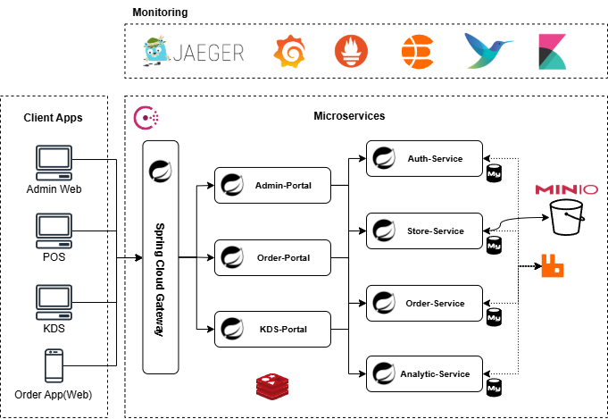

# Casha POS 專案拓樸

**Casha POS** 是一套專為餐飲業 (F&B) 打造的系統，採用 **Spring Boot 3.4.8** 與 **Spring Cloud 2024** 建構後端微服務，前端則以 **Vue 3 + 組合式 API** 搭配 **Element Plus** 開發。系統涵蓋後台管理、POS 點餐、KDS 廚房顯示與消費者自助點餐，並整合多種中介軟體與觀測工具，支援高併發交易與全鏈路監控。

## 客戶端應用 (Client Apps)

- **Admin Web**：後台管理系統，用於帳號、權限與餐廳配置。
- **POS**：櫃台點餐端，處理訂單建立與結帳。
- **KDS (Kitchen Display System)**：廚房顯示端，接收訂單並支援出餐流程。
- **Order App (Web)**：顧客使用的自助點餐 Web 應用，支援掃描 QRCode 下單。

## 微服務 (Microservices)

- **Spring Cloud Gateway**：所有流量的入口，負責路由轉發、JWT 驗證、服務發現與 API 管控。
- **Admin-Portal**：BFF，對接前端 Admin Web，負責與 Auth-Service、Store-Service 溝通。
- **Order-Portal**：BFF，服務 POS 與自助點餐應用，負責與 Order-Service 互動。
- **KDS-Portal**：BFF，專為廚房顯示端設計，串接 Order-Service。
- **Auth-Service**：身分驗證與權限管理，包含帳號、角色、權限控制。
- **Store-Service**：餐廳與分店管理，包含菜單、座位、商品與 QRCode 設定，支援 **MinIO** 圖片檔案存取。
- **Order-Service**：核心訂單服務，處理點餐、狀態流轉，並透過 **RabbitMQ** 進行訂單事件傳遞。
- **Analytic-Service**：數據分析與報表，聚合交易與使用行為數據。

## 中介軟體與基礎設施

- **Redis**：快取服務，支援 session、token 與高頻查詢快取。
- **RabbitMQ**：消息佇列，處理訂單事件與跨服務異步通信。
- **MinIO**：S3 相容物件存儲，主要用於圖片、檔案上傳與存取。

## 監控與可觀測性

- **Jaeger**：分散式追蹤，追蹤跨服務的請求鏈路。
- **Prometheus**：指標收集，抓取 Spring Boot Actuator metrics。
- **Grafana**：監控大盤，統一可視化。
- **ElasticSearch + Kibana**：集中式日誌管理與查詢。
- **FluentBit**：日誌收集與轉發。

## 架構特點

1. **前後端分離 + BFF 模式**：Admin、POS、KDS、Order App 各有專屬入口，降低耦合。
2. **高併發交易處理**：Redis + RabbitMQ 確保訂單高效能與可擴展。
3. **全鏈路可觀測性**：監控、日誌、追蹤工具整合，便於快速定位問題。
4. **模組化設計**：Auth、Store、Order、Analytic 各自獨立，支援服務擴展與水平擴容。
5. **雲原生友好**：服務與中介軟體均容器化，支援 Kubernetes 部署。
