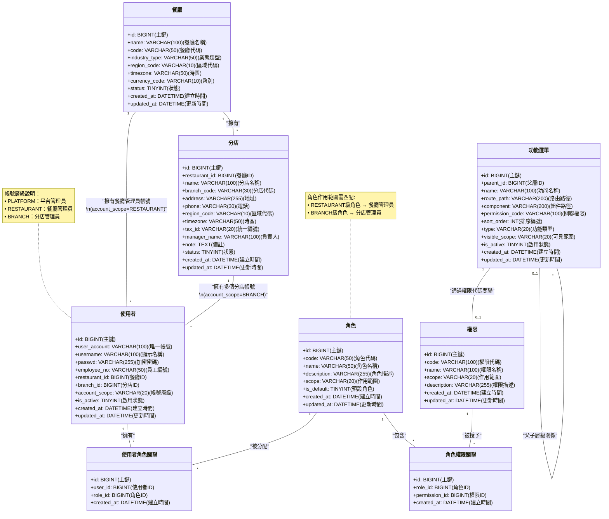

# RBAC

以角色為基礎的存取控制（Role-Based Access Control，RBAC) 是一種透過「角色」橋接使用者與權限的授權模型。

本專案以:

* 三層級架構：明確區分平台（PLATFORM）、餐廳（RESTAURANT）、分店（BRANCH）三個作用域，符合餐飲連鎖業的組織需求
* 權限顆粒化：透過 permission_code 與功能選單綁定，同時支援頁面（PAGE）與按鈕（BUTTON）級控制
* 多租戶隔離：餐廳與分店ID貫穿所有資料表，天然支持集團式多店管理

同時結合 Spring Security 綁定 API 與使用權限, 功能選單表（function_menu）透過 permission_code 關聯前端路由，實現「權限即菜單」的直觀設計。

## UML

