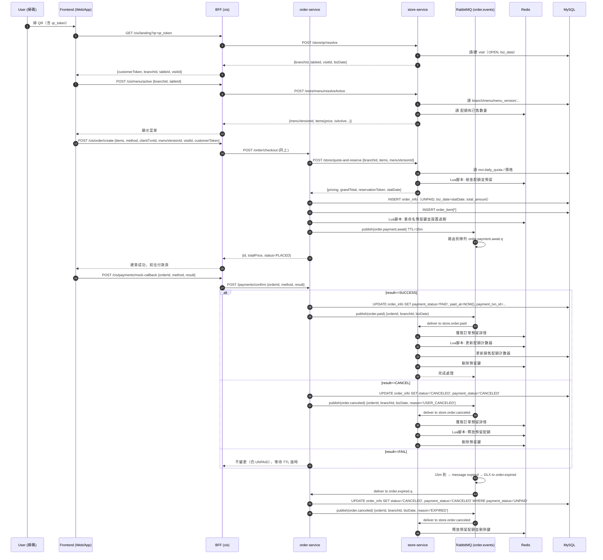

# 暫存

```
casha-order/
├─ src/
│  ├─ api/
│  │  ├─ axios.ts
│  │  ├─ public.ts            # resolve-seat / menu / orders
│  │  └─ media.ts             # 取圖片代理URL
│  ├─ components/
│  │  ├─ CartFloat.vue
│  │  ├─ CartDrawer.vue
│  │  ├─ ItemCard.vue
│  │  └─ QuantityStepper.vue
│  ├─ router/
│  │  └─ index.ts
│  ├─ store/
│  │  ├─ session.ts           # branchId / visitId / menuVersionId / customerToken
│  │  └─ cart.ts              # 購物車邏輯
│  ├─ types/
│  │  ├─ apiResponse.ts
│  │  └─ dto/
│  │     ├─ public/
│  │     │  ├─ resolveSeat.ts
│  │     │  ├─ menu.ts
│  │     │  └─ createOrder.ts
│  │     └─ common.ts
│  ├─ views/
│  │  ├─ LandingView.vue      # /m/:token 進站解析
│  │  ├─ HomeView.vue         # 首頁（餐廳名稱 + 開始點餐按鈕）
│  │  ├─ OrderView.vue        # 類別/商品 & 懸浮購物車
│  │  ├─ ItemDetailView.vue   # 單品詳情 + 加入購物車
│  │  ├─ PaymentSelectView.vue# 付款方式選擇（Line Pay/臨櫃）
│  │  └─ OrderConfirmView.vue # 下單完成確認（下一步可加）
│  ├─ App.vue
│  └─ main.ts
└─ index.html

```



---
---

# 全流程（掃碼 → 菜單 → 建單預留 → 等待付款 → 成功/取消/逾時）明細

## 0) 掃碼進場（建立/沿用訪次）
- **API**
  - FE → BFF：`GET /cis/landing?qr=<qr_token>`
  - BFF → STO：`POST /store/qr/resolve`
- **DB**
  - `visit`：若該桌無 OPEN 則 `INSERT` 一筆（`status=OPEN`, `biz_date=依分店時區+換日規則`）
- **前端保存**
  - `customerToken`, `branchId`, `tableId`, `visitId`

---

## 1) 顯示有效菜單（含售罄）
- **API**
  - FE → BFF：`POST /cis/menu/active { branchId, tableId }`
  - BFF → STO：`POST /store/menu/resolveActive`
- **DB（讀）**
  - `branch`、`menu`、`menu_version`、`menu_version_item`、`item`、`item_category`
- **Redis（讀）**
  - `q:rsv:{bizDate}:{branchId}:{mviId}`（預留量）
  - `q:paid:{bizDate}:{branchId}:{mviId}`（已付量）
- **售罄判斷**
  - `used = (q:rsv||0) + (q:paid||0)`
  - `isSoldOut = daily_quota != null && used >= daily_quota`
- **回傳**
  - `menuVersionId`、分類/品項、`price`、`isActive`

---

## 2) 建單（再次計價 + 預留 + 綁定 + 逾時排程）

### 2.1 BFF 與 order-service
- **API**
  - FE → BFF：`POST /cis/order/create { items[{itemId,qty}], paymentMethod, clientTxnId, menuVersionId, visitId, customerToken }`
  - BFF → ORD：`POST /order/checkout`（同內容）

### 2.2 order-service → store-service（再次計價 + 預留）
- **API**
  - ORD → STO：`POST /store/quote-and-reserve { branchId, menuVersionId, items }`
- **DB（讀）**
  - `menu_version_item.daily_quota` + `mvi.price`
- **Redis（原子 Lua）**
  - **逐 mvi 檢核**：`used_before = (q:rsv + q:paid)`；若 `used_before + qty > daily_quota` → 拒絕
  - **通過**：
    - `INCRBY q:rsv:{bizDate}:{branchId}:{mviId} qty`
    - `HSET rsv:tmp:{tokenId} {mviId} qty`（EX=120~300s）
- **回傳**
  - `pricing[]`、`grandTotal`、`reservationToken`（簽名，含 `tokenId:branchId:bizDate`）、`statDate`

### 2.3 order-service（建單 + 綁定 + 逾時）
- **DB（寫）**
  - `order_info`：`INSERT`
    - `status='PLACED'`, `payment_status='UNPAID'`, `payment_method`, `biz_date=statDate`, `total_amount=grandTotal`, `branch_id`, `visit_id`, `menu_version_id`, `client_txn_id`, `customer_token`
  - `order_item[*]`：`INSERT`
    - `name_snapshot`, `price_snapshot`, `qty`, `notes`
- **Redis（原子 Lua 綁定）**
  - 驗簽 `reservationToken` 取 `tokenId`
  - `RENAME rsv:tmp:{tokenId} -> ord:resv:{orderId}`
  - `HSET ord:resv:{orderId} __bizDate {bizDate} __branchId {branchId}`
  - `EXPIRE ord:resv:{orderId} 900s`
- **MQ（排程逾時）**
  - Exchange：`order.events` (topic)
  - Publish：`routingKey=order.payment.await`, body=`orderId`, **message TTL=900000**
  - Queue：`order.payment.await.q`
    - `x-dead-letter-exchange=order.events`
    - `x-dead-letter-routing-key=order.expired`
  - **15 分鐘後** → Broker 將訊息 dead-letter 到 `order.expired.q`

- **BFF → FE 回傳**
  - `{ id=orderId, totalPrice=grandTotal, status=PLACED }`

**此刻 Redis/DB/MQ 狀態**
- Redis
  - `q:rsv:{bizDate}:{branchId}:{mviId}`：每項加上預留數
  - `ord:resv:{orderId}`（Hash, EX=900）
    ```
    __bizDate=yyyy-MM-dd
    __branchId=<long>
    <mviId1>=qty
    <mviId2>=qty
    ```
- DB
  - `order_info(payment_status='UNPAID', paid_at=NULL)`
  - `order_item[*]`
- MQ
  - `order.payment.await.q` 內有一則 TTL=15m 訊息（等待逾時）

---

## 3) 付款確認

### 3A. 成功
- **API**
  - FE → BFF：`POST /cis/payments/mock-callback {orderId, method, result='SUCCESS'}`
  - BFF → ORD：`POST /payments/confirm { ... }`
- **DB**
  - `UPDATE order_info SET payment_status='PAID', paid_at=NOW(), payment_txn_id=:txn WHERE id=:orderId AND payment_status='UNPAID'`
- **MQ（事件）**
  - Publish：`order.paid` → Exchange `order.events`
  - Payload：`{ orderId, branchId, bizDate }`（來自 DB 的權威值）
  - Queue：`store.order.paid`
- **store-service（消費 order.paid）**
  - Redis：`HGETALL ord:resv:{orderId}`
  - For each mvi：
    - (Lua) `DECRBY q:rsv:{biz}:{br}:{mvi} qty`
    - (Lua) `INCRBY q:paid:{biz}:{br}:{mvi} qty`
  - DB：`sales_quota_counter` upsert `used_qty += qty`（`stat_date=bizDate, branch_id, mviId, slot='ALL_DAY'`)
  - Redis：`DEL ord:resv:{orderId}`

### 3B. 使用者取消
- **API**
  - FE → BFF：`POST /cis/payments/mock-callback {orderId, result='CANCEL'}`
  - BFF → ORD：`POST /payments/confirm`
- **DB**
  - `UPDATE order_info SET status='CANCELED', payment_status='CANCELED' WHERE id=:orderId AND payment_status='UNPAID'`
- **MQ**
  - Publish：`order.canceled`（`{orderId, branchId, bizDate, reason='USER_CANCELED'}`）
  - Queue：`store.order.canceled`
- **store-service（消費 order.canceled）**
  - Redis：`HGETALL ord:resv:{orderId}`
  - For each mvi：`DECRBY q:rsv:{biz}:{br}:{mvi} qty`
  - Redis：`DEL ord:resv:{orderId}`

### 3C. 失敗（不立刻取消）
- **API** 同上但 `result='FAIL'`
- **DB**：不變（仍 `UNPAID`）
- **等待**：由 15m TTL 逾時流程接手（下一節）

---

## 4) 15 分鐘逾時（自動取消）
- **MQ（Broker 行為）**
  - `order.payment.await.q` 中訊息 TTL 到 → **dead-letter** 到 `order.expired`
  - Queue：`order.expired.q`（order-service 消費）
- **order-service（消費 order.expired）**
  - DB：`UPDATE order_info SET status='CANCELED', payment_status='CANCELED' WHERE id=:orderId AND payment_status='UNPAID'`
  - MQ：Publish `order.canceled`（`{orderId, branchId, bizDate, reason='EXPIRED'}`）
- **store-service（消費 order.canceled）**
  - Redis：釋放 `q:rsv--`，`DEL ord:resv:{orderId}`

---

## 5) 關鍵命名速查

### Redis
- `q:rsv:{bizDate}:{branchId}:{mviId}` → 今日預留量（整數）
- `q:paid:{bizDate}:{branchId}:{mviId}` → 今日已付量（整數）
- `rsv:tmp:{tokenId}` → 暫存預留（Hash `{mviId->qty}`，EX=120~300s）
- `ord:resv:{orderId}` → 訂單預留（Hash，EX=900）
  - `__bizDate`、`__branchId`、`<mviId>=qty`

### RabbitMQ
- Exchange：`order.events` (topic)
- Queues：
  - `order.payment.await.q`（bind=`order.payment.await`，**message TTL=15m**，`x-dlx=order.events`, `x-dlrk=order.expired`）
  - `order.expired.q`（bind=`order.expired`，order-service 消費）
  - `store.order.paid`（bind=`order.paid`，store-service 消費）
  - `store.order.canceled`（bind=`order.canceled`，store-service 消費）

### DB（核心欄位）
- `order_info`：
  - `id, branch_id, visit_id, menu_version_id, customer_token, client_txn_id (UK)`,
  - `status, payment_status, total_amount, payment_method`,
  - `paid_at (付款成功才寫)`, `payment_txn_id`, `biz_date`,
  - `created_at, updated_at`
- `order_item`：`order_id, item_id, name_snapshot, price_snapshot, qty, notes`
- `sales_quota_counter`（UK=`stat_date, branch_id, menu_version_item_id, slot_key`）：
  - `used_qty`（`order.paid` 時累加）

---

## 6) 冪等與一致性
- 建單：`uk_branch_client_txn` 防重
- 預留：`rsv:tmp -> ord:resv` Lua 綁定；目標存在則視為成功（冪等）
- 付款：`WHERE payment_status='UNPAID'` 的條件更新，首次成功寫 `paid_at`
- 事件：listener 讀不到 `ord:resv:{orderId}` 直接返回（冪等）；Redis 用 Lua 保證 `rsv--/paid++` 原子
- 逾時與成功競態：靠條件更新與刪除 `ord:resv` 保證最終一致


# Redis Key 一覽（含觸發者/來源）

| 服務 | Key 名稱（樣例） | 型別 | 內容重點 | 何時建立/更新 | TTL / 到期點 | 移除/清理機制 | 觸發者 / 來源 |
|---|---|---|---|---|---|---|---|
| **store-service** | `rsv:tmp:{tokenId}` | Hash | 暫存預留：`{mviId -> qty}`；可能有 `__NO_LIMITED=1` | `/store/quote-and-reserve` 成功後建立 | **120 秒** | 建單綁定時被 **RENAME**；未綁定則 TTL 自動過期 | 建立：`QuoteAndReserveUseCaseImpl -> RedisQuotaAdapter.reserveAndIssueToken`；刪除/搬移：`order-service ReservationRedisAdapterWithVerify.bindReservation` 或 Redis |
| **order-service** | `ord:resv:{orderId}` | Hash | 訂單預留（待付款）：`{mviId -> qty}`, `__bizDate`, `__branchId` | 綁定預留時建立（`RENAME` 自 `rsv:tmp`） | **15 分鐘**（付款時限） | 付款成功/取消時 **DEL**；逾時 TTL 自動過期 | 建立：`ReservationRedisAdapterWithVerify.bindReservation`；刪除：`store OrderPaidListener`(成功) / `store OrderCanceledListener`(取消/逾時) / Redis |
| **store-service** | `q:rsv:{bizDate}:{branchId}:{mviId}` | String(int) | 該日**預留**累計量 | 預留時 **INCRBY**（Lua） | **下一營業日開始 + 12h**（依分店時區與 `biz_day_start_hour`，Lua 內 `EXPIREAT`） | 付款成功時可能 **DECRBY**（保守結算）；取消/逾時 **DECRBY**；到期自動過期 | 建/更：`RedisQuotaAdapter.reserveAndIssueToken / settlePaid / releaseReservation / settlePaidOrderFromHash`；過期：Redis |
| **store-service** | `q:paid:{bizDate}:{branchId}:{mviId}` | String(int) | 該日**已付款**累計量 | 付款結算時 **INCRBY**（Lua） | **下一營業日開始 + 36h**（Lua 內 `EXPIREAT`） | 一般由 TTL 自動過期（DB 為權威） | 建/更：`RedisQuotaAdapter.settlePaid / settlePaidOrderFromHash`；過期：Redis |
| **cis (BFF)** | `visit:byCustomer:{customerToken}` | String | 顧客綁定訪次：`{visitId}|{branchId}|{tableId}` | 掃碼/綁定時 `SETEX`；讀取時滑動續期 | 依流程設定（常用 = `auto_close_minutes` 秒） | 訪次關閉時**DEL**；否則 TTL 自動過期 | 建/更：`VisitBindingRedisAdapter.saveBinding / resolveByCustomerToken`；刪：訪次關閉流程；過期：Redis |
| **cis (BFF)** | `visit:customers:{visitId}` | Set | 該訪次內所有 `customerToken` | 顧客加入訪次 `SADD`；滑動續期 | 預設 **8 小時**（可依需求改 `auto_close_minutes`） | 訪次關閉時**DEL**；否則 TTL 自動過期 | 建/更：`VisitBindingRedisAdapter.addCustomerToVisit / resolveByCustomerToken`；刪：訪次關閉；過期：Redis |
| **cis (BFF)** | `cis:menu:active:v1:{branchId}` | String(JSON) | 有效菜單快取 | `/cis/menu/active` 緩存未命中後回源寫入 | 約 **3 分鐘**（含 jitter） | 新寫覆蓋或 TTL 自動過期 | 建/更：`FindMenuActiveUseCaseImpl.writeToCache`；過期：Redis |
| **cis (BFF)** | `lock:cis:menu:active:v1:{branchId}` | String | 建菜單快取用的鎖（value=uuid） | 回源建快取前 `SET NX EX 3` | **3 秒** | 釋放鎖時 Lua 檢查 token 後 **DEL**；或 TTL 自動過期 | 建：`FindMenuActiveUseCaseImpl.acquireLock`；釋放：`FindMenuActiveUseCaseImpl.releaseLock` 或 Redis |
