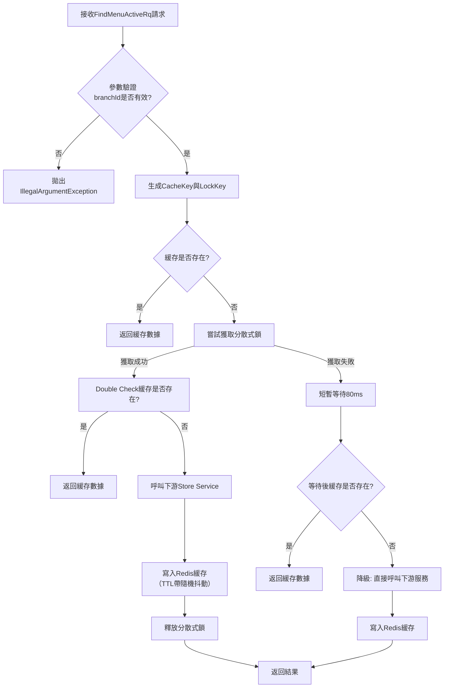

# 菜單緩存機制

簡單來說, Menu 是一個快取優先讀取 (Cache First) 的設計, 當第一個人訪問該 QR Code 並獲取菜單後, 菜單的內容與訊息便會儲存在 Redis Cache 內, 並且設定 180 ± (180 * 20%) 秒的 TTL (Time To Live), 來分散尖峰時刻 Cache 同時過期導致大量用戶請求湧入的風險; 而後面的用戶則會快取命中 (Cache Hit), 直接取用快取資料。

本設計的核心要點為:

1. 快取優先：首先嘗試從 Redis 讀取緩存，命中則直接返回。
2. 鎖競爭：若緩存未命中，嘗試獲取分散式鎖，確保只有一個執行緒能重建緩存。
3. 雙重檢查：成功獲取鎖後，再次檢查緩存，避免重複計算。
4. 呼叫下游：確認需要重建後，呼叫 store-service 獲取最新菜單數據。
5. 寫入緩存：將獲取到的數據寫入 Redis，並設置隨機抖動的 TTL。
6. 降級策略：未獲取到鎖的執行緒會短暫等待後再次嘗試讀取緩存。若仍失敗，則降級直接呼叫下游服務並寫入緩存，保證可用性。
7. 安全釋放鎖：使用 Lua 腳本原子性地釋放鎖，確保只有鎖的持有者能釋放它。

---

## 流程



### 逐步詳細說明

#### 階段零：準備與參數驗證 (Preparation & Validation)

1. 接收請求：方法入口，接收 FindMenuActiveRq 請求物件。
2. 驗證必要參數：檢查請求中的 branchId 欄位。如果為 null 或空字串，立即拋出 IllegalArgumentException。這是防止無效請求的第一步。
3. 生成金鑰：使用通過驗證的 branchId，生成兩個 Redis Key：
   * cacheKey：格式為 cis:menu:active:v1:{branchId}，用於儲存實際的菜單快取資料（JSON 格式）。
   * lockKey：格式為 lock:cis:menu:active:v1:{branchId}，用作分散式鎖的 Key，防止多個執行緒/程序同時重建快取。

#### 階段一：快取優先讀取 (Cache First)

4. 嘗試讀取快取：使用 cacheKey 從 Redis 中讀取快取字串。
   * 快取命中 (Cache Hit)：如果存在資料，則使用 ObjectMapper 將 JSON 字串反序列化為 FindMenuActiveRs 物件。記錄 debug 日誌並立即返回結果，流程結束。這是效能最高的路徑。
   * 快取未命中 (Cache Miss)：如果 Redis 中沒有該 Key 或讀取失敗，記錄 debug 日誌，進入下一階段。

#### 階段二：競爭鎖與重建快取 (Lock Competition & Cache Rebuilding)

5. 準備競爭鎖：生成一個全域唯一的 lockToken（UUID），用於安全地釋放鎖，避免誤刪其他執行緒的鎖。
6. 嘗試獲取分散式鎖：

   * 使用 SET lockKey lockToken NX EX LOCK_EXPIRE_SECONDS 指令（經由 setIfAbsent 方法）原子性地嘗試獲取鎖。
   * 這條指令只有在 lockKey 不存在時才會設定成功，並且會給鎖設定一個較短的過期時間（3秒），防止持有鎖的執行緒崩潰導致鎖永遠無法釋放（死鎖）。

7. 分支處理 - 情景A：成功獲取鎖 (Cache Builder)
   * 雙重檢查 (Double-Check)：在拿到鎖之後、進行昂貴的下游呼叫之前，再次檢查快取。目的：在競爭激烈的情況下，可能在自己成功獲取鎖的極短時間內，已經有另一個執行緒完成了快取重建並釋放了鎖。這一步能避免無謂的重複工作。
   * 呼叫下游服務：如果雙重檢查後快取依然為空，則構造請求參數，通過 Feign Client 呼叫 store-service 的 /resolveActive API 來獲取最新的菜單資料。這是整個流程中最耗時、成本最高的操作
   * 轉換與寫入快取：將下游返回的 StoreResolveMenuRs 轉換為 BFF 的 FindMenuActiveRs 物件。然後將其序列化為 JSON，並寫入 Redis。
   * TTL 抖動：寫入時設定的 TTL 不是固定的 180 秒，而是 180 ± (180 * 20%) 秒之間的一個隨機值。這能讓同一時間寫入的大量快取在未來不同的時間點過期，避免「快取雪崩」。
   * 返回結果：將從下游獲取到的最新資料返回給客戶端。

8. 分支處理 - 情景B：未能獲取鎖 (Follower)

   * 退避等待：未能拿到鎖，意味著已經有另一個執行緒（情景A）正在重建快取。當前執行緒不會傻等，而是主動睡眠一段短時間（80ms），以等待那個持有鎖的執行緒完成快取寫入。

   * 再次嘗試讀取：睡眠結束後，再次嘗試從快取中讀取資料。在大多數情況下，此時快取已經由持有鎖的執行緒重建完成，因此可以成功命中並返回。

   * 降級策略：這是一個保險措施。如果即使在退避等待後，快取依然為空（例如：持有鎖的執行緒執行非常慢，或在寫入快取前失敗了），則不再等待，而是直接降級呼叫下游服務。雖然這違背了「防止擊穿」的初衷，但作為最後的保障，它保證了系統的可用性（寧可少量請求擊穿，也不能讓所有請求失敗）。同時，它也會將獲取到的結果寫入快取，以服務後續的請求。

#### 階段三：清理階段 (Cleanup)

9. 釋放鎖：無論是正常返回還是發生異常，只要當前執行緒成功獲取了鎖，就必須在 finally 程式碼塊中執行鎖釋放邏輯。

   * 安全釋放：釋放鎖不是簡單地 DEL lockKey，而是透過執行一個 Lua 腳本來原子性地完成「比對鎖令牌值 -> 刪除」的操作。這確保了只有鎖的持有者才能刪除它，防止誤刪後續其他執行緒設定的新鎖。

## 程式實作

```java
package com.casha.cis.domain.usecase.menu;

import com.casha.cis.application.dto.FindMenuActiveRq;
import com.casha.cis.application.dto.FindMenuActiveRs;
import com.casha.cis.application.usecase.menu.FindMenuActiveUseCase;
import com.casha.cis.infrastructure.client.feign.StoreMenuFeignClient;
import com.casha.common.shared.web.ApiResponse;
import com.casha.contract.store.menu.StoreResolveMenuRq;
import com.casha.contract.store.menu.StoreResolveMenuRs;
import lombok.RequiredArgsConstructor;
import lombok.extern.slf4j.Slf4j;
import org.springframework.data.redis.core.RedisTemplate;
import org.springframework.data.redis.core.script.DefaultRedisScript;
import org.springframework.stereotype.Service;

import java.time.Duration;
import java.util.Collections;
import java.util.UUID;
import java.util.concurrent.ThreadLocalRandom;
import java.util.concurrent.TimeUnit;

@Slf4j
@Service
@RequiredArgsConstructor
public class FindMenuActiveUseCaseImpl implements FindMenuActiveUseCase {

    private final StoreMenuFeignClient storeMenuFeignClient;
    // 專用於緩存菜單數據的 RedisTemplate
    private final RedisTemplate<String, FindMenuActiveRs> menuRedisTemplate;
    // 專用於處理分散式鎖的 RedisTemplate (String -> String)
    private final RedisTemplate<String, String> lockRedisTemplate;

    // Redis Key 格式定義
    private static final String MENU_CACHE_KEY_FMT = "cis:menu:active:v1:%s";        // {branchId}
    private static final String MENU_LOCK_KEY_FMT = "lock:cis:menu:active:v1:%s";   // {branchId}
    private static final int BASE_TTL_SECONDS = 180; // 基礎緩存過期時間：3分鐘
    private static final int LOCK_EXPIRE_SECONDS = 3; // 鎖的過期時間，必須短於業務處理時間

    // 用於原子性釋放鎖的 Lua 腳本
    private static final String UNLOCK_LUA_SCRIPT =
            "if redis.call('get', KEYS[1]) == ARGV[1] then " +
                    "   return redis.call('del', KEYS[1]) " +
                    "else " +
                    "   return 0 " +
                    "end";

    @Override
    public FindMenuActiveRs findActive(FindMenuActiveRq rq) {
        // 參數驗證：branchId 為必填欄位
        if (rq.getBranchId() == null || rq.getBranchId().isBlank()) {
            throw new IllegalArgumentException("branchId is required");
        }

        String branchId = rq.getBranchId();
        String cacheKey = buildMenuCacheKey(branchId); // 構建緩存 Key
        String lockKey = buildMenuLockKey(branchId);   // 構建鎖 Key

        // ==================== 階段一：嘗試讀取緩存 ====================
        log.debug("[菜單緩存] 嘗試讀取緩存，分店ID: {}", branchId);
        FindMenuActiveRs cachedMenu = menuRedisTemplate.opsForValue().get(cacheKey);
        if (cachedMenu != null) {
            log.debug("[菜單緩存] 緩存命中，分店ID: {}", branchId);
            return cachedMenu; // 緩存命中，直接返回結果
        }
        log.debug("[菜單緩存] 緩存未命中，分店ID: {}", branchId);

        // ==================== 階段二：緩存未命中，準備獲取鎖 ====================
        String lockToken = UUID.randomUUID().toString(); // 生成唯一鎖令牌
        boolean isLockAcquired = acquireLock(lockKey, lockToken); // 嘗試獲取分散式鎖

        try {
            if (isLockAcquired) {
                // 情景A：成功獲取到鎖（當前執行緒成為負責重建緩存的執行緒）
                log.debug("[菜單緩存] 成功獲取鎖，分店ID: {}", branchId);
                
                // 重要：雙重檢查 (Double-Check) - 再次檢查緩存，避免在獲取鎖期間已有其他執行緒寫入緩存
                cachedMenu = menuRedisTemplate.opsForValue().get(cacheKey);
                if (cachedMenu != null) {
                    log.debug("[菜單緩存] 雙重檢查緩存命中，分店ID: {}", branchId);
                    return cachedMenu;
                }

                // 緩存確實為空，需要呼叫下游服務獲取最新數據
                log.info("[菜單緩存] 呼叫 store-service 獲取菜單數據，分店ID: {}", branchId);
                StoreResolveMenuRs storeMenuRs = callStoreService(rq);

                // 將下游服務的響應轉換為 BFF 層的 DTO
                FindMenuActiveRs result = convertToResult(storeMenuRs);
                
                // 將結果寫入 Redis 緩存，並設置帶有抖動的 TTL
                writeToCache(cacheKey, result);
                return result;

            } else {
                // 情景B：未能獲取到鎖（有其他執行緒正在重建緩存）
                log.debug("[菜單緩存] 未能獲取鎖，分店ID: {}，進入降級路徑", branchId);
                
                // 短暫退避（80ms），等待持有鎖的執行緒完成緩存寫入
                sleepQuietly(80);

                // 退避後再次嘗試讀取緩存
                log.debug("[菜單緩存] 退避後再次嘗試讀取緩存，分店ID: {}", branchId);
                cachedMenu = menuRedisTemplate.opsForValue().get(cacheKey);
                if (cachedMenu != null) {
                    log.debug("[菜單緩存] 退避後緩存命中，分店ID: {}", branchId);
                    return cachedMenu;
                }

                // 即使退避後緩存仍為空，可能因為持有鎖的執行緒執行過慢或失敗
                // 為了避免大量請求持續擊穿到下游服務，進行降級：直接呼叫下游服務
                log.warn("[菜單緩存] 降級：繞過鎖直接呼叫 store-service，分店ID: {}", branchId);
                StoreResolveMenuRs storeMenuRs = callStoreService(rq);
                FindMenuActiveRs result = convertToResult(storeMenuRs);
                
                // 關鍵：在降級路徑中也寫入緩存，避免後續請求繼續擊穿
                writeToCache(cacheKey, result);
                return result;
            }
        } finally {
            // ==================== 階段三：清理工作 ====================
            // 只有成功獲取鎖的執行緒才需要釋放鎖
            if (isLockAcquired) {
                releaseLock(lockKey, lockToken);
                log.debug("[菜單緩存] 鎖已釋放，分店ID: {}", branchId);
            }
        }
    }

    /**
     * 呼叫下游 store-service 獲取有效的菜單數據
     * 此方法封裝了 Feign 客戶端呼叫和響應處理
     */
    private StoreResolveMenuRs callStoreService(FindMenuActiveRq rq) {
        StoreResolveMenuRq bizRq = new StoreResolveMenuRq();
        bizRq.setBranchId(rq.getBranchId());
        bizRq.setTableId(rq.getTableId()); // TableId 可能用於日誌記錄或未來功能

        ApiResponse<StoreResolveMenuRs> response = storeMenuFeignClient.resolveActive(bizRq);
        
        // 檢查下游服務響應碼，若非成功則拋出異常
        if (!"00000".equals(response.getResponseCode())) {
            String errorMsg = String.format("從 store-service 獲取菜單失敗。分店ID: %s, 錯誤碼: %s, 錯誤訊息: %s",
                    rq.getBranchId(), response.getResponseCode(), response.getMsg());
            log.error(errorMsg);
            throw new RuntimeException(errorMsg);
        }
        return response.getData();
    }

    /**
     * 將 store-service 的響應 DTO 轉換為 BFF 的響應 DTO
     */
    private FindMenuActiveRs convertToResult(StoreResolveMenuRs storeRs) {
        FindMenuActiveRs rs = new FindMenuActiveRs();
        rs.setMenuVersionId(storeRs.getMenuVersionId());
        rs.setVersionNo(storeRs.getVersionNo());
        rs.setBizDate(storeRs.getBizDate());
        rs.setTimeWindow(storeRs.getTimeWindow());
        rs.setVersionHash(storeRs.getVersionHash());
        rs.setCategories(storeRs.getCategories());
        rs.setItems(storeRs.getItems());
        return rs;
    }

    /**
     * 將數據寫入 Redis 緩存，並使用帶有隨機抖動的 TTL
     * 抖動策略：在基礎 TTL 的基礎上增加 ±20% 的隨機波動，避免緩存同時大量失效（雪崩效應）
     */
    private void writeToCache(String key, FindMenuActiveRs value) {
        int ttlWithJitter = calculateTtlWithJitter(BASE_TTL_SECONDS);
        menuRedisTemplate.opsForValue().set(key, value, ttlWithJitter, TimeUnit.SECONDS);
        log.debug("[菜單緩存] 緩存更新成功，Key: {}, TTL: {}秒", key, ttlWithJitter);
    }

    /**
     * 嘗試獲取分散式鎖
     * 使用 SET key value NX EX 指令，保證原子性
     */
    private boolean acquireLock(String lockKey, String lockToken) {
        Boolean acquired = lockRedisTemplate.opsForValue().setIfAbsent(
                lockKey,
                lockToken,
                Duration.ofSeconds(LOCK_EXPIRE_SECONDS) // 鎖會自動過期，避免死鎖
        );
        return Boolean.TRUE.equals(acquired);
    }

    /**
     * 使用 Lua 腳本原子性地釋放分散式鎖
     * 腳本邏輯：比對鎖的值是否與當前執行緒的令牌一致，一致則刪除，否則不做操作
     */
    private void releaseLock(String lockKey, String lockToken) {
        try {
            DefaultRedisScript<Long> script = new DefaultRedisScript<>(UNLOCK_LUA_SCRIPT, Long.class);
            Long result = lockRedisTemplate.execute(script, Collections.singletonList(lockKey), lockToken);
            if (result == null || result == 0) {
                log.debug("[菜單緩存] 鎖釋放失敗（可能已過期或被其他執行緒釋放）。Key: {}", lockKey);
            }
        } catch (Exception e) {
            log.warn("[菜單緩存] 釋放鎖時發生異常，Key: {}", lockKey, e);
            // 通常可以忽略此處異常，因為鎖設有自動過期時間，最終會自動釋放
        }
    }

    /**
     * 構建菜單緩存的 Redis Key
     */
    private static String buildMenuCacheKey(String branchId) {
        return String.format(MENU_CACHE_KEY_FMT, branchId);
    }

    /**
     * 構建分散式鎖的 Redis Key
     */
    private static String buildMenuLockKey(String branchId) {
        return String.format(MENU_LOCK_KEY_FMT, branchId);
    }

    /**
     * 計算帶有隨機抖動的 TTL 值
     * 公式：基礎時間 ± (基礎時間 * 20%)，並確保不小於 60 秒
     */
    private static int calculateTtlWithJitter(int baseSeconds) {
        int jitterRange = Math.round(baseSeconds * 0.2f); // 計算抖動範圍（±20%）
        return Math.max(60, baseSeconds + ThreadLocalRandom.current().nextInt(-jitterRange, jitterRange + 1));
    }

    /**
     * 安靜地讓當前執行緒睡眠指定毫秒數，並處理中斷異常
     */
    private static void sleepQuietly(long milliseconds) {
        try {
            Thread.sleep(milliseconds);
        } catch (InterruptedException e) {
            Thread.currentThread().interrupt(); // 恢復中斷狀態
            log.warn("[菜單緩存] 執行緒睡眠被中斷。");
        }
    }
}
```
