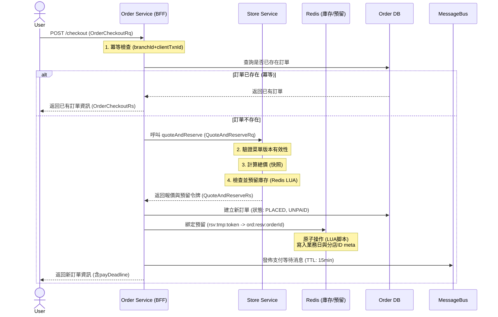
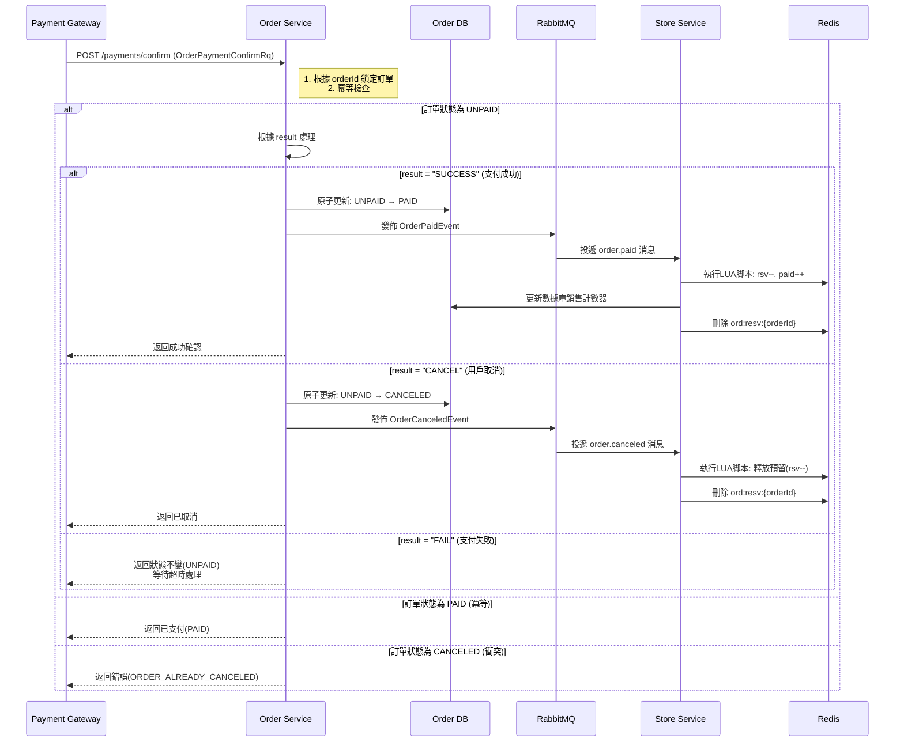
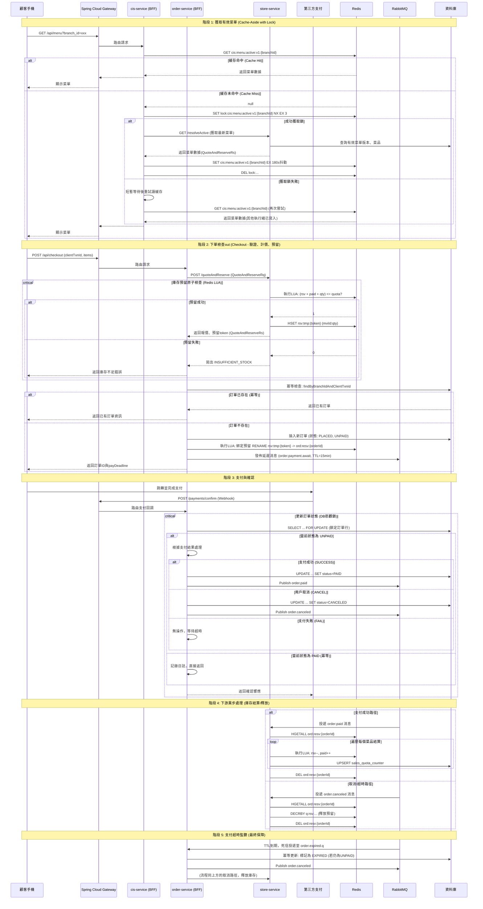

# 點餐流程

點餐的流程起自 ```用戶掃碼到顯示訂單完成```, 前置作業要完成菜單的配置。上述提到用戶在掃碼後獲取餐廳與分店等訊息, 並取得菜單資訊，下一步便能在菜單上點餐並前往購物車結帳。

目前的設計沒有真正串接金流, 而是在前端自行發送一個 mock 的付款按鈕, 所以核心付款的 api 會是:

> 1. /cis/order/create: 創建訂單, 支付前準備, 同時會最終確認存貨是否充足
> 2. /cis/payments/mock-callback: 模擬支付方付款成功時的 callbacl method

## 1. order/create

這個 API 的核心目的是：處理使用者在點選「下單」或「結帳」按鈕後、實際發起支付前的所有準備工作。它是一個集「存貨驗證」、「最終計價」、「庫存預留」和「訂單創建」於一體的原子性操作。

該 api 在 BFF 層僅做轉發, 在 Biz 主要職責可分解為：

1. 最終報價與鎖庫： 由 order-service 呼叫下游 store-service 進行最終的存貨檢查與計價，並預留庫存。
2. 冪等性保證：防止因客戶端重試（如網路抖動、用戶雙擊）而導致重複下單。
3. 創建訂單：將訂單資訊（含快照）持久化到資料庫，狀態為「已下單，未支付」(PLACED, UNPAID)。
4. 綁定預留：將臨時的庫存預留令牌與剛創建的正式訂單綁定，為後續的支付成功/失敗處理做準備。
5. 支付超時管理：發送一個延遲消息，設定支付時限（如15分鐘），超時後系統將自動取消訂單並釋放預留的庫存。

其最終目標是生成一個待支付的訂單，並確保在支付過程中，用戶所見的價格和庫存是確定的、被臨時鎖定的。



### 逐步詳細說明

#### 階段一：接收請求與冪等檢查

1. 接收請求：API 入口，接收 OrderCheckoutRq 請求。該請求包含：
   * clientTxnId: 客戶端交易ID（由前端生成，如UUID），用於實現冪等性。
   * menuVersionId: 用戶下單時所見的菜單版本ID。
   * items: 用戶選擇的菜品列表（含數量、備註）。
   * customerToken: 用戶標識。
   * paymentMethod: 支付方式。
2. 構造下游請求：將客戶端請求參數轉換為呼叫 store-service 所需的 QuoteAndReserveRq 格式。
3. 呼叫下游服務 (StorePricingPort.quoteAndReserve)：這是整個流程中最關鍵的一步。它透過 Feign Client 呼叫 store-service 的相應接口。store-service 內部會執行：
   * 業務驗證：檢查菜單版本 (menuVersionId) 在當前時間對該分店是否有效（營業日期、星期幾、時間段）。
   * 獲取單價與計算總價：根據菜單版本ID和菜品ID，獲取菜品的最新單價，計算每一行的金額（unitPrice * qty）和總金額（grandTotal）。此處的單價和名稱會被「快照」到響應中，防止後續菜單變更影響已下訂單。
   * 庫存預留 (RedisQuotaPort.reserveAndIssueToken)：這是防止超賣的核心。
     * 遍歷每一個菜品，檢查其是否有每日限量 (dailyQuota)。
     * 對於有限量的菜品，使用 LUA 脚本原子性地檢查並預留庫存。脚本邏輯：已預留量(rsv) + 已售出量(paid) + 本次需求(qty) <= 總限量(quota)。如果檢查通過，則增加預留量 (rsv)。
     * 如果任何一個菜品庫存不足，預留操作會失敗並拋出 INSUFFICIENT_STOCK 異常，導致下單失敗。
     * 預留成功後，會生成一個臨時預留令牌 (tokenId)，並將本次預留的詳細資訊（菜品ID及其對應數量）存入一個臨時 Redis Key (rsv:tmp:{tokenId}) 中，並設置一個較短的 TTL（120秒）。這個令牌將返回給 order-service。
4. 冪等檢查：拿到 store-service 返回的 branchId 後，結合請求中的 clientTxnId，查詢資料庫中是否已經存在相同的訂單。如果存在，則直接返回已存在的訂單資訊。這確保了即使客戶端重複發送請求，也只會產生一個訂單。

#### 階段二：創建訂單與後續處理

5. 創建訂單物件：如果訂單不存在，則開始創建訂單物件 (OrderInfo)。
   * 字段來源：部分來自請求（如 customerToken, paymentMethod），關鍵部分來自 store-service 的響應（如 branchId, 總金額(grandTotal), 業務日期(statDate)）。
   * 初始狀態：設置為 "PLACED" (訂單狀態) 和 "UNPAID" (支付狀態)。

6. 保存訂單與快照：將訂單主資訊和訂單行項目（菜品快照：下單時的單價、名稱、數量）一起持久化到資料庫中。這保證了後續即使菜單變了，用戶的訂單資訊也不會變。
7. 綁定預留 (ReservationPort.bindReservation)：
   * 目的：將臨時預留 (rsv:tmp:{tokenId}) 轉換為正式訂單預留 (ord:resv:{orderId})。
   * 流程：使用 LUA 脚本原子性地完成 RENAME 操作，並在新的訂單預留 Hash 中寫入後續結算所需的元數據（__bizDate, __branchId），同時設置一個合理的 TTL（900秒，即15分鐘，與支付超時時間一致）。
   * 重要性：這一步將庫存預留資源與訂單ID正式關聯起來。後續無論是支付成功後扣減預留並增加銷量，還是支付超時/失敗後釋放預留，都依賴於 ord:resv:{orderId} 這個 Key。

8. 發送支付超時消息 (MessageBusPort.publishPaymentAwait)：向消息中間件（如 RabbitMQ）發送一條 延遲消息（Delay Message），這條消息會在指定的 TTL（15分鐘）後被消費。消費者將負責檢查訂單是否仍未支付，若未支付則觸發訂單自動取消和庫存釋放流程。

#### 階段三：響應結果

9. 構造並返回響應：將創建好的訂單資訊轉換為 OrderCheckoutRs 響應物件返回給客戶端。響應中包含了：
   * id: 訂單ID。
   * status: 訂單狀態。
   * totalPrice: 總價。
   * payDeadline: 支付截止時間（通常為當前時間 + 15分鐘）。客戶端應根據此時間倒計時並提示用戶。

#### 階段四：支付超時與自動取消處理

這個階段雖然不在 checkout 方法的同步執行路徑中，但卻是保障系統最終一致性、防止庫存永久鎖定的核心設計。

10. 支付超時監聽與處理：
    * 機制定義：在 checkout 階段發送的 order.payment.await 消息帶有 TTL（15分鐘）。RabbitMQ 會在消息過期後，自動將其轉為死信 (Dead Letter)，並通過配置的 DLX (Dead Letter Exchange) 和 DLK (Dead Letter Routing Key) 將其重新路由到 order.expired.q 隊列。
    * 監聽處理 (OrderExpiredListener)：
    * 冪等檢查：監聽器從消息中獲取訂單ID，首先嘗試更新資料庫中的訂單狀態（例如：markCanceledIfUnpaid(orderId, "EXPIRED")）。這個操作被設計為冪等的，僅在訂單當前狀態仍為 UNPAID 時才會執行更新。如果訂單已支付或已取消（例如用戶在最後一刻完成支付），則更新行數為0，監聽器直接返回，不做後續處理。
    * 發佈取消事件：如果訂單確因超時被取消，監聽器會構造並發佈一個 OrderCanceledEvent 事件到消息隊列（如路由鍵 order.canceled），通知其他服務（主要是 store-service）進行後續清理工作。

11. 庫存預留釋放 (OrderCanceledListener)：
    * 監聽取消事件：store-service 監聽 order.canceled 事件。
    * 釋放預留：根據事件中的訂單ID，找到對應的預留Key (ord:resv:{orderId})。讀取其中保存的預留詳情（哪些菜品、預留了多少），然後原子性地減少Redis中對應菜品的預留量 (q:rsv:)。
    * 清理預留記錄：最後，刪除 ord:resv:{orderId} 這個Key本身。整個過程同樣是冪等的。

## 2. payments/mock-callback

理支付提供商發送的非同步支付結果通知，並根據結果更新訂單狀態、驅動後續業務流程（如庫存結算或釋放）。

它是一個冪等的操作，需要妥善處理以下情況：

1. 支付成功：將訂單狀態更新為「已支付」，並觸發庫存預留轉為實際銷售的流程。
2. 用戶取消：用戶在支付過程中主動取消，立即釋放預留的庫存。
3. 支付失敗：支付因各種原因失敗，保持訂單為「未支付」狀態，等待超時流程來處理。
4. 重複通知：支付提供商可能重複發送通知，API 必須能識別並正確處理已處理過的訂單。



### 逐步詳細

#### 階段一：接收回調與冪等檢查

1. 接收支付回調：API 入口，接收支付通道發送的 OrderPaymentConfirmRq 請求。該請求包含：
   * orderId: 訂單ID。
   * result: 支付結果（SUCCESS, CANCEL, FAIL）。
   * providerTxnId: 支付通道的交易ID，用於對賬。
   * amount: (可選) 支付金額，用於校驗。

2. 悲觀鎖定訂單：根據 orderId，以悲觀鎖（SELECT ... FOR UPDATE）的方式從數據庫中讀取訂單當前狀態。這一步至關重要，它防止了在併發情況下（如支付回調和超時取消同時發生）對訂單狀態的競態條件（Race Condition）更新。
3. 冪等性檢查：檢查訂單當前的支付狀態 (paymentStatus)：
   * 如果已是 PAID：這是一次重複的通知。記錄日誌並直接返回成功響應，告知支付通道「已處理」。
   * 如果已是 CANCELED：這是一個狀態衝突（例如用戶取消的同時支付成功了）。必須拒絕處理，拋出異常告知支付通道「訂單已取消」，通常支付通道會需要進行退款操作。
   * 如果是 UNPAID：進入核心處理邏輯。

#### 階段二：根據支付結果進行分支處理

4. 分支處理 - 情景A：支付成功 (SUCCESS)
   * 金額校驗（可選）：比較回調中的支付金額與訂單金額是否一致，防止錯誤支付。
   * 原子更新狀態：執行 UPDATE 語句，條件性地將訂單狀態從 UNPAID 更新為 PAID。這個操作是原子的，並返回受影響的行數。如果返回0，說明在極短暫的瞬間狀態已被其他操作改變（如超時取消），需要重新讀取狀態並返回。
   * 發佈支付成功事件：構造並發佈 OrderPaidEvent 到消息隊列。該事件包含了訂單ID、分店ID、業務日期等關鍵信息，驅動下游的 store-service 進行庫存結算。

5. 分支處理 - 情景B：用戶主動取消 (CANCEL)
   * 原子更新狀態：立即將訂單狀態更新為 CANCELED。
   * 發佈取消事件：構造並發佈 OrderCanceledEvent 到消息隊列，驅動下游的 store-service 立即釋放預留的庫存。這與超時取消的流程一致，但觸發更及時。

6. 分支處理 - 情景C：支付失敗 (FAIL) 或其他
   * 無操作：不更新訂單狀態，保持其為 UNPAID。
   * 後續處理：訂單將繼續等待第15分鐘時由超時監聽器自動處理（取消並釋放庫存）。這是一種「失敗安全」的設計，避免在網路閃斷等暫時性問題下過早釋放庫存。

#### 階段三：下游服務處理庫存結算 (OrderPaidListener)

7. 監聽支付成功事件：store-service 監聽 order.paid 消息。
8. 獲取預留詳情：根據訂單ID，從 Redis 中讀取對應的預留Hash (ord:resv:{orderId})，獲取所有需要結算的菜品ID和數量。
9. 原子結算庫存：對於每一個菜品：
   * Redis結算：使用 LUA 脚本原子性地執行兩步操作：
   1. 減少預留量 (q:rsv:)：將該菜品預留的數量減去（保守扣減，最多減到0）。
   2. 增加已售量 (q:paid:)：將該菜品已售出的數量加上（全額加上）。
   * 數據庫落盤：將銷售數量同步更新到數據庫的日銷售計數器中。採用 UPSERT 策略（先UPDATE，失敗則INSERT，再UPDATE）來處理併發情況下的初始化問題。

10. 清理預留記錄：結算完成後，刪除 ord:resv:{orderId} 這個Key。整個結算過程是冪等的，即使消息重複消費也不會導致庫存數據錯亂。

#### 階段四：響應支付通道

11. 構造並返回響應：根據處理結果，構造 OrderPaymentConfirmRs 響應物件返回給支付通道。響應中包含了：

* orderId: 訂單ID。
* status: 訂單的最新狀態（PAID, CANCELED, UNPAID）。
* 支付通道收到成功的響應（如HTTP 200）後，便知道通知已送達並處理完畢，不會再重複發送。


## Final



