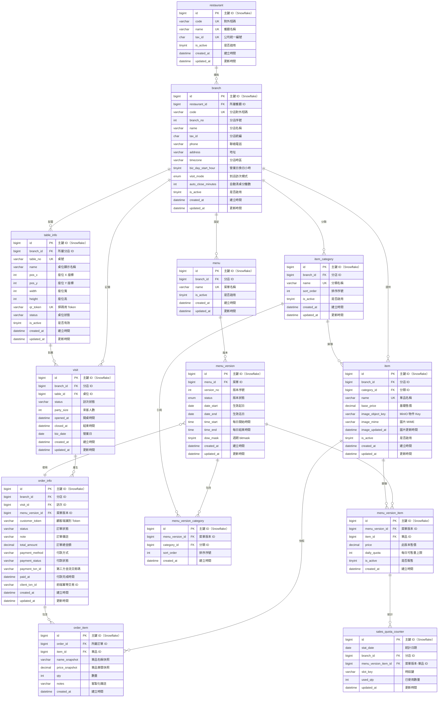

# 餐點與訂單整理

## 1. MySQL Schema

## 2. 行為準則／流程

### A. 代碼/短碼產生（`restaurant.code` / `branch.code`）

- **餐廳碼**：建議以 **Snowflake → Base32/36** 轉換後取 5~6 碼，排除易混字（I/O/1/l），衝突時重試；**全域唯一**。  
- **分店碼**：**層級碼**，`branch.code = restaurant.code + branch_no`（如 `AEJ1D9` + `1` → `AEJ1D91`）；`(restaurant_id, branch_no)` 唯一。  
- 對外呈現/QR/小票皆使用 `code`，便於人工辨識。

### B. `dow_mask` 週期規則

- `dow_mask` 是 **7 位 bitmask**（TINYINT UNSIGNED）；**bit0=週一 ... bit6=週日**。  
- 判斷公式：`((dow_mask >> (dow-1)) & 1) = 1`（`dow`：1~7）  
- 常用組合：  
  - 每天：`127`（`0b1111111`）  
  - 週一到週五：`31`（`0b0011111`）  
  - 週六、週日：`96`（`0b1100000`）

### C. 菜單版本命中規則（掃碼 → 取菜單）

1. 解析 `qr_token` → 得到 `branch_id`, `table_id`；依 `branch.timezone` 計算 `nowLocal`。  
2. 計算 `bizDate`（依 `biz_day_start_hour`）。  
3. 計算 `dow`（1=Mon..7=Sun）與 `timeNow`（HH:mm:ss）。  
4. 從 `menu_version` 選出符合：  
   - `status IN ('SCHEDULED','ACTIVE')`  
   - `bizDate BETWEEN date_start AND date_end`  
   - `((dow_mask >> (dow-1)) & 1) = 1`  
   - **每日時段**：  
     - 一般：`time_start <= timeNow < time_end`  
     - 跨午夜（`time_start > time_end`）：`timeNow >= time_start OR timeNow < time_end`  
5. 若無命中 → 回覆「非營業時段」，並可提供下一個可用窗口（下次 `date + time_start~time_end`）。  
6. 若多個命中 → 以 `version_no` 較新或 `priority`（如有）決定。

> **排程切換非必要**：可不必把版本真的切 `ACTIVE`，於查詢時按條件動態判定即可。

### D. 訪次/桌位模式（支援不同店型）

- `branch.visit_mode`：  
  - `ATTENDED`（帶位）：由店員手動開桌/清桌。  
  - `AUTO`（自動）：第一人掃碼 → 自動建立 `visit(OPEN)`，`table_info.status=IN_USE`；  
    無互動超過 `auto_close_minutes` 且所有訂單完結 → **自動清桌**（`visit.CLOSED`，桌回 `IDLE`）。  
    仍允許店員手動覆蓋。  
  - `DISABLED`（不追桌）：掃碼下單不建立 `visit`，用取餐號碼/櫃臺流程（失去翻桌/桌聚合報表）。  
- **限制**：同一 `table_id` 同時只允許一個 `OPEN visit`（靠 `uk_visit_open_single` + 應用層鎖）。

### E. 下單／冪等／可售量（僅「每日配額」）

- 下單流程（簡化）：
  1) 取「命中的 `menu_version` + `menu_version_item`」  
  2) **Redis Lua 原子扣減**每日配額（**無時段配額**）：  
     - Key：`quota:{bizDate}:{branchId}:{menuVersionItemId}:ALL_DAY`  
     - 參數：`delta=本次購買數`，`cap=daily_quota（NULL 視為無上限）`  
     - 檢查 `used + delta <= cap`，否則回 `QUOTA_EXCEEDED`  
  3) 寫入 `order_info` / `order_item`（**名稱/價格快照**）  
  4) 事件送 KDS；**最終一致**落盤到 `sales_quota_counter`（`ON DUPLICATE KEY UPDATE used_qty += delta`）  
  5) 取消訂單需 **回補 Redis** 與 `sales_quota_counter`  
- **冪等**：`order_info` 以 `(branch_id, client_txn_id)` 唯一鍵避免重複訂單。  
- **停售**：`menu_version_item.is_active=0` 可強制停售並即時反映到前台。

### F. 付款（線上/臨櫃）

- 欄位：`payment_method(ONLINE/COUNTER)`, `payment_status(UNPAID/PAID/REFUND/CANCELED)`, `payment_txn_id`, `paid_at`。  
- **線上**：下單 → 金流頁 → 成功回呼 → `payment_status=PAID`。  
- **臨櫃**：POS 標記已收 → `payment_status=PAID`，`payment_method=COUNTER`。  
- 本版 **不做**合併結帳；一人一單各自付款。

### G. 單品圖片（MinIO，後端代理，長快取）

- `item.image_object_key` 保存 MinIO Key（bucket 私有）。  
- 前端取圖 **永遠走後端**：`GET /media/item/{itemId}`  
  - 後端產生 **短期 Pre-signed URL** 並 302 轉向，或直接反向代理串流。  
  - 設定 `Cache-Control: public, max-age=86400, stale-while-revalidate=3600`。  
  - URL 加 `?v=<epoch(image_updated_at)>` 版本參數以破壞快取；更新圖片時只要更新 `image_updated_at`。  
- 可預先產生多尺寸版本（如 w-400, w-800）以提速。

### H. 報表 / 指標（MVP）

- 當日：GMV、訂單數、客單價、Top N 單品、售罄率（`used / daily_quota`）、翻台率（`visit`）  
- 依 `biz_date` 聚合，避免午夜切割；`branch.biz_day_start_hour` 需全系統一致使用。

### I. 典型 Use Case 範例（平日/假日菜單）

- **平日**（一～五）版本：`dow_mask=31 (0b0011111)`；**2025-09-01 ~ 2025-09-30，08:00–14:00**  
- **假日**（六/日）版本：`dow_mask=96 (0b1100000)`；**2025-09-01 ~ 2025-09-30，08:00–14:00**  
- 掃碼時依星期自動命中對應版本；若不在時間窗 → 回「非營業時段」。

### J. 風險與守則

- **版本重疊**：儲存/發佈時做交疊檢查；若允許重疊需定義優先級（建議以 `version_no` 新者優先）。  
- **跨午夜時段**：盡量避免；若需要，以 `time_start > time_end` 規則處理。  
- **一致性**：可售量以 Redis 為準、`sales_quota_counter` 做對賬；所有訂單皆保存快照避免改價影響歷史。

---

## 三、前後台操作重點（摘要）

- **後台**：  
  - 版本編輯：日期區間、每日時間、`dow_mask`（Mon..Sun Toggle）  
  - 一鍵複製至下月、批量設定價格/配額、即時停售  
  - 分店設定可切 `visit_mode` 與 `auto_close_minutes`
- **前台**：  
  - 命中版本即顯示菜單；未命中顯示「非營業時段」及下一次時段  
  - 同桌多人各自下單、互不可見（靠 `customer_token`）；KDS 以 `visit_id` 聚合顯示