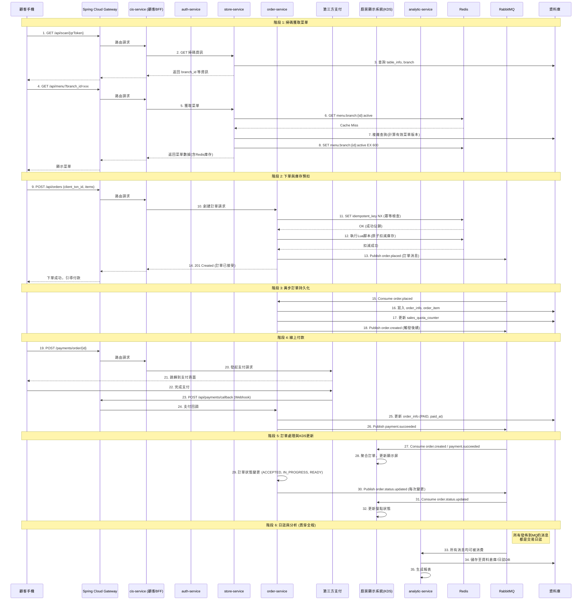

# 點餐流程

```mermaid
sequenceDiagram
    participant User as 顧客手機
    participant Gateway as Spring Cloud Gateway
    participant CIS as cis-service (顧客BFF)
    participant Auth as auth-service
    participant Store as store-service
    participant Order as order-service
    participant Payment as 第三方支付
    participant KDS as 廚房顯示系統(KDS)
    participant Analytic as analytic-service
    participant Redis as Redis
    participant RabbitMQ as RabbitMQ
    participant DB as 資料庫

    Note over User, DB: 階段 1: 掃碼獲取菜單
    User->>Gateway: 1. GET /api/scan/{qrToken}
    Gateway->>CIS: 路由請求
    CIS->>Store: 2. GET 掃碼資訊
    Store->>DB: 3. 查詢 table_info, branch
    Store-->>CIS: 返回 branch_id 等資訊
    CIS-->>Gateway: 
    Gateway-->>User: 

    User->>Gateway: 4. GET /api/menu?branch_id=xxx
    Gateway->>CIS: 路由請求
    CIS->>Store: 5. 獲取菜單
    Store->>Redis: 6. GET menu:branch:{id}:active
    Redis-->>Store: Cache Miss
    Store->>DB: 7. 複雜查詢(計算有效菜單版本)
    Store->>Redis: 8. SET menu:branch:{id}:active EX 600
    Store-->>CIS: 返回菜單數據(含Redis庫存)
    CIS-->>Gateway: 
    Gateway-->>User: 顯示菜單

    Note over User, DB: 階段 2: 下單與庫存預扣
    User->>Gateway: 9. POST /api/orders (client_txn_id, items)
    Gateway->>CIS: 路由請求
    CIS->>Order: 10. 創建訂單請求

    Order->>Redis: 11. SET idempotent_key NX (冪等檢查)
    Redis-->>Order: OK (成功佔鎖)
    Order->>Redis: 12. 執行Lua脚本(原子扣減庫存)
    Redis-->>Order: 扣減成功

    Order->>RabbitMQ: 13. Publish order.placed (訂單消息)
    Order-->>CIS: 14. 201 Created (訂單已接受)
    CIS-->>Gateway: 
    Gateway-->>User: 下單成功，引導付款

    Note over User, DB: 階段 3: 異步訂單持久化
    RabbitMQ->>Order: 15. Consume order.placed
    Order->>DB: 16. 寫入 order_info, order_item
    Order->>DB: 17. 更新 sales_quota_counter
    Order->>RabbitMQ: 18. Publish order.created (觸發後續)

    Note over User, DB: 階段 4: 線上付款
    User->>Gateway: 19. POST /payments/order/{id}
    Gateway->>CIS: 路由請求
    CIS->>Payment: 20. 發起支付請求
    Payment-->>User: 21. 跳轉到支付頁面
    User->>Payment: 22. 完成支付

    Payment->>Gateway: 23. POST /api/payments/callback (Webhook)
    Gateway->>Order: 24. 支付回調
    Order->>DB: 25. 更新 order_info (PAID, paid_at)
    Order->>RabbitMQ: 26. Publish payment.succeeded

    Note over User, DB: 階段 5: 訂單處理與KDS更新
    RabbitMQ->>KDS: 27. Consume order.created / payment.succeeded
    KDS->>KDS: 28. 聚合訂單，更新顯示屏

    Order->>Order: 29. 訂單狀態變更 (ACCEPTED, IN_PROGRESS, READY)
    Order->>RabbitMQ: 30. Publish order.status.updated (每次變更)
    RabbitMQ->>KDS: 31. Consume order.status.updated
    KDS->>KDS: 32. 更新餐點狀態

    Note over User, DB: 階段 6: 日誌與分析 (貫穿全程)
    Note right of RabbitMQ: 所有發佈到MQ的消息<br/>都是交易日誌
    RabbitMQ->>Analytic: 33. 所有消息均可被消費
    Analytic->>DB: 34. 儲存至資料倉庫/日誌DB
    Analytic->>Analytic: 35. 生成報表
```